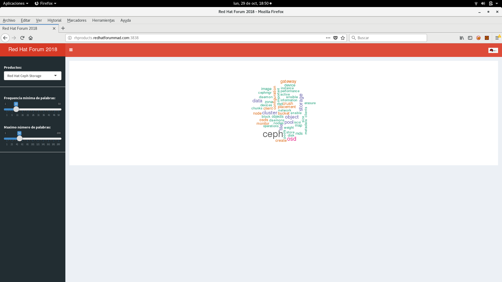

# Application

This web application lets you to select a Red Hat product:

* Red Hat Ceph Storage
* Openshift Container Platform
* Red Hat Openstack Platform
* Red Hat Virtualization
* Red HAt Ansible Automation

and creates a word cloud from a data file stored in a S3 endpoint provided by Red Hat Ceph Storage.

