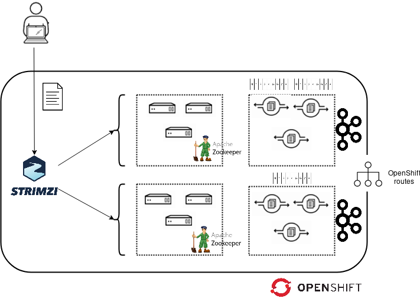

# Lab01: Deploy AMQ Streams

In this lab we will use **AMQ Streams** operator to deploy and configure kafka.

## High level architecture



## Lab's purpose

Illustrate how **AMQ Streams** is deployed to be used by applications later.

## Deploying Kafka Cluster operator

Create the `amq-streams` project:

```
$ oc new-project amq-streams
```
Deploy operator and cluster operator and its related resources with:

```
$ oc apply -f resources/cluster-operator/ -n amq-streams
$
```
This amq-streams Cluster Operator is configured to watch all namespaces since the **STRIMZI_NAMESPACE** environment variable from the operator yaml deployment file has the value *
As we have configured the Cluster Operator to watch all namespaces, it's also required to configure additional __ClusterRoleBindings__ to grant cluster-wide access to the Cluster Operator.

```
$ oc adm policy add-cluster-role-to-user strimzi-cluster-operator-namespaced --serviceaccount strimzi-cluster-operator -n amq-streams
$ oc adm policy add-cluster-role-to-user strimzi-entity-operator --serviceaccount strimzi-cluster-operator -n amq-streams
$ oc adm policy add-cluster-role-to-user strimzi-topic-operator --serviceaccount strimzi-cluster-operator -n amq-streams
$
```

## Create a new kafka cluster

>  **WARNING**: The goal of this lab is not focused on creating a valid production architecture, so we'll use ephemeral backed volumes (emptyDir) for our kafka cluster.
Ephemeral storage is commonly used for testing purposes.

To deploy a new kafka cluster, just create a new Kafka resource. The provided Kafka resource will deploy 3 kafka brokers + 3 zookeeper nodes. The entity operator is also automatically deployed by the cluster operator, is responsible for managing different entities in a running Kafka cluster such as users and topics.

```
$ oc new-project rhte2019
$ oc apply -f resources/openshift/kafka-cluster.yml -n rhte2019
$
```

A successful deployment should look like:

```
$ oc get pod -n rhte2019
NAME                                          READY     STATUS    RESTARTS   AGE
rhte-cluster-entity-operator-57f77467-8h8c9   3/3       Running   0          47s
rhte-cluster-kafka-0                          2/2       Running   0          80s
rhte-cluster-kafka-1                          2/2       Running   0          80s
rhte-cluster-kafka-2                          2/2       Running   0          80s
rhte-cluster-zookeeper-0                      2/2       Running   0          111s
rhte-cluster-zookeeper-1                      2/2       Running   0          111s
rhte-cluster-zookeeper-2                      2/2       Running   0          111s
$
```

## Create new topic

Create a topic with a replication factor of 1 and 1 partition:

```
$ oc apply -f resources/openshift/rhte-topic.yml -n rhte2019
$
```

Verify its creation with:

```
$ oc get kafkatopics -n rhte2019
NAME      PARTITIONS   REPLICATION FACTOR
rhte      1            1
$ oc rsh -n rhte2019 -c kafka rhte-cluster-kafka-0 bin/kafka-topics.sh --describe --bootstrap-server localhost:9092 --topic rhte
OpenJDK 64-Bit Server VM warning: If the number of processors is expected to increase from one, then you should configure the number of parallel GC threads appropriately using -XX:ParallelGCThreads=N
Topic:rhte      PartitionCount:3        ReplicationFactor:1     Configs:message.format.version=2.2-IV1
        Topic: rhte	Partition: 0	Leader: 1	Replicas: 1	Isr: 1
$
```

The traces above indicate that a new `rhte` topic is created with a replication factor of 1 and composed by 1 partition.
As stated previously, this environment is being created for learning purposes thus the previous topic was created as simple as possible: 1 replica + 1 partition

The provided kafka-cluster resource includes an option to make the operator create a route that will be be used for access kafka brokers from outside OCP cluster:

```
$ oc get route -n rhte2019
NAME                           HOST/PORT                                                      PATH      SERVICES                                PORT      TERMINATION   WILDCARD
rhte-cluster-kafka-0           rhte-cluster-kafka-0-rhte2019.apps.cluster.testing.com                   rhte-cluster-kafka-0                    9094      passthrough   None
rhte-cluster-kafka-1           rhte-cluster-kafka-1-rhte2019.apps.cluster.testing.com                   rhte-cluster-kafka-1                    9094      passthrough   None
rhte-cluster-kafka-2           rhte-cluster-kafka-2-rhte2019.apps.cluster.testing.com                   rhte-cluster-kafka-2                    9094      passthrough   None
rhte-cluster-kafka-bootstrap   rhte-cluster-kafka-bootstrap-rhte2019.apps.cluster.testing.com           rhte-cluster-kafka-external-bootstrap   9094      passthrough   None
$
```

Broker's routes must be used in the steps below

>  **TIP**: You should take note about the route, and the topic name because you will use them in the [Lab04: Machine Learning/Artificial Inteligence workloads](https://github.com/jadebustos/ocp-science/blob/master/hands-on-lab-script/applications/ml.md).

## Send a picture to the previous topic

We can send a picture to the previous created topic using the provided containerized client.
In the example below, the _data_ directory is a host directory holding several pictures like _cat.jpg_

```
$ podman run -v ./data:/data --rm quay.io/rhte_2019/ocp-science-clients kafkaClient \
 -tls -brokers=rhte-cluster-kafka-rhte2019.apps.cluster-apps.sandbox45.examlple.com:443 \
 -topic=rhte -insecure-skip-verify -file /data/cat.jpg
$
```

## Lab resources

You can find all the resources to build the container [here](https://github.com/jadebustos/ocp-science/tree/master/hands-on-lab-script/intro/aio-client).
