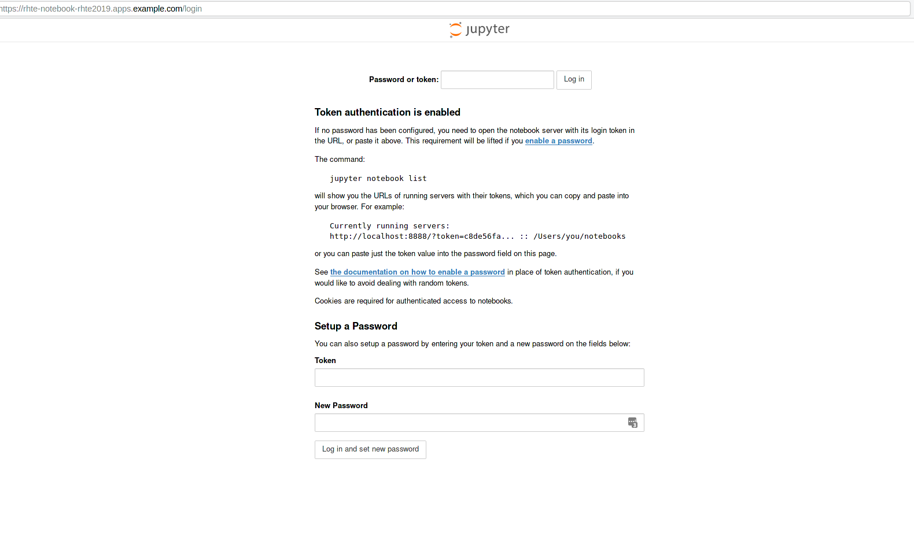

# Applications

The following applications will be deployed:

* Lab01: [R Shiny workloads](r-shiny.md)
* Lab02: [Machine learning/Artificial Inteligence workloads](ml.md)
* Lab03: [Training workloads](training.md)
* Lab04: [Computing workloads](pi.md)

## Notebooks

Create notebook:
```
$ oc run --image=quay.io/rhte_2019/ai-notebook:latest --port=8080 rhte-notebook
```

Create service and route
```
$ oc expose dc rhte-notebook
$ oc create route edge --service=rhte-notebook
```

The notebook should be available at the exposed route:

```
$ oc get route
NAME            HOST/PORT                                 PATH      SERVICES        PORT      TERMINATION   WILDCARD
rhte-notebook   rhte-notebook-rhte2019.apps.example.com             rhte-notebook   <all>     edge          None
```

Using a browser go to the previous route https://rhte-notebook-rhte2019.apps.example.com



## Training your employees

The first notebooks were provided by [Mathematica](http://www.wolfram.com/mathematica/) but nowadays notebooks are commonly being used by the community. They have become a standard:

* [iPython notebooks](https://ipython.org/notebook.html)
* [Jupyter notebooks](https://jupyter.org/) (the iPython notebook successor)
* [R notebooks](https://bookdown.org/yihui/rmarkdown/notebook.html)
* [Apache Zeppelin notebooks](https://zeppelin.apache.org/)
* [Spark notebooks](http://spark-notebook.io/)

In this hands-on lab we will only use **Jupyter notebooks** but we could have used any of the above technologies.
