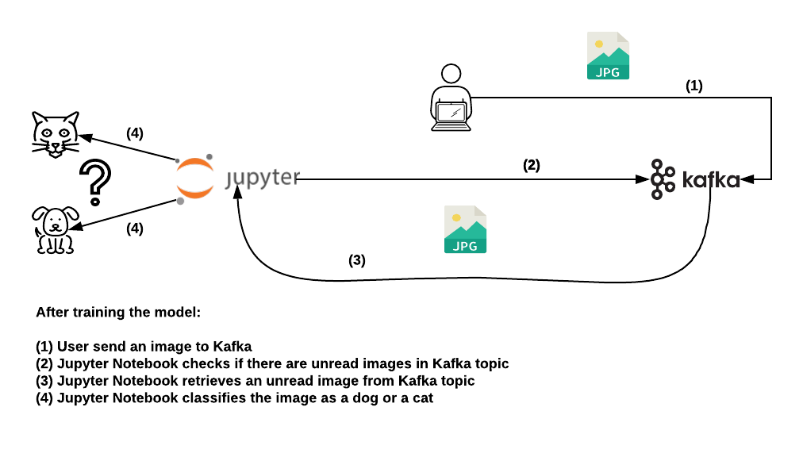
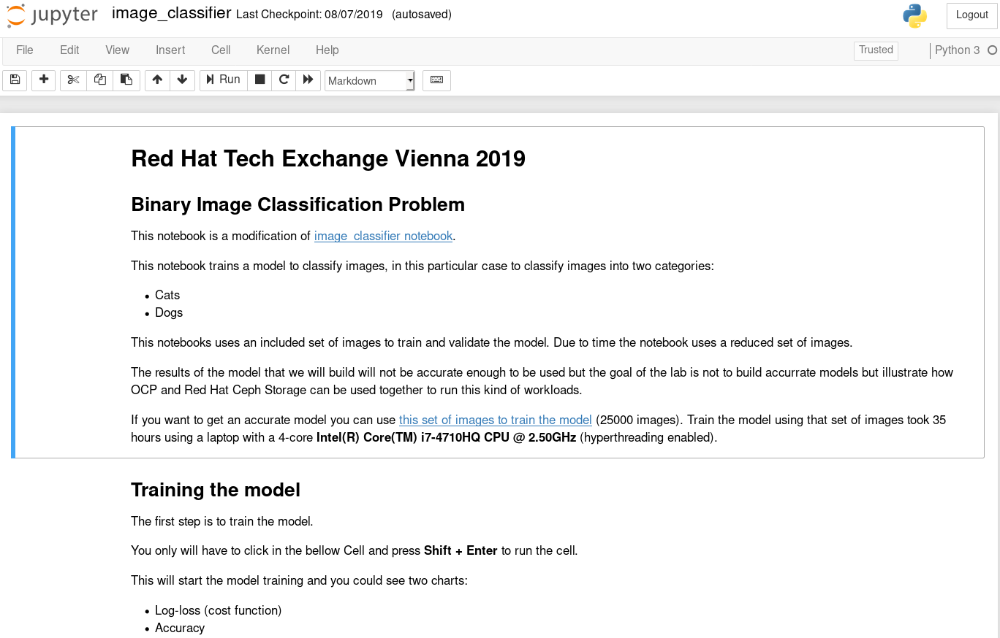
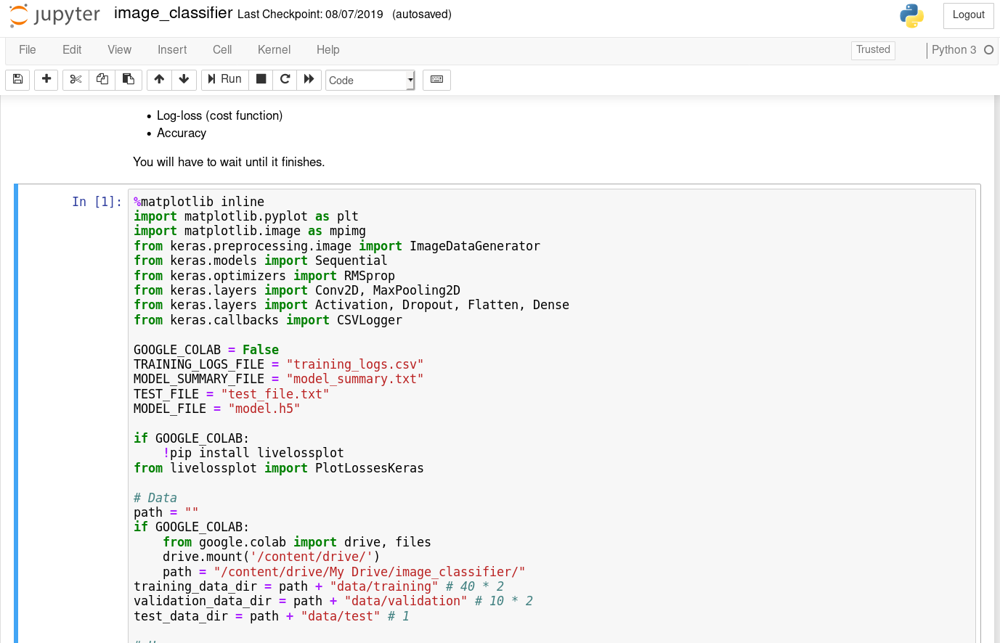
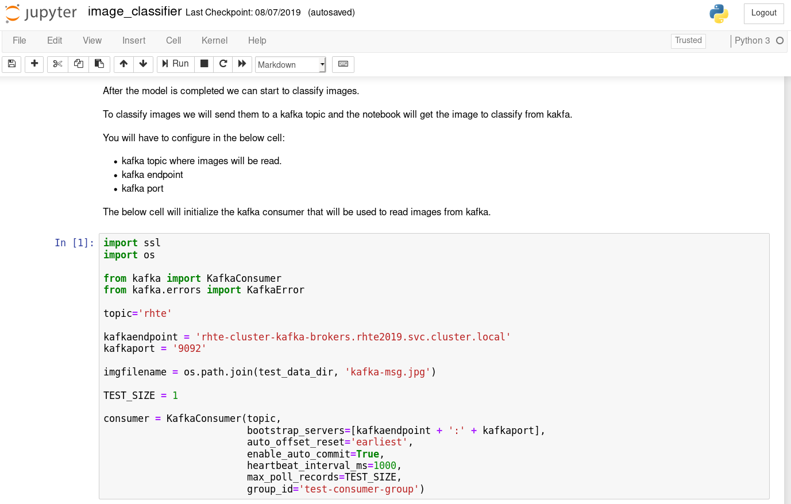
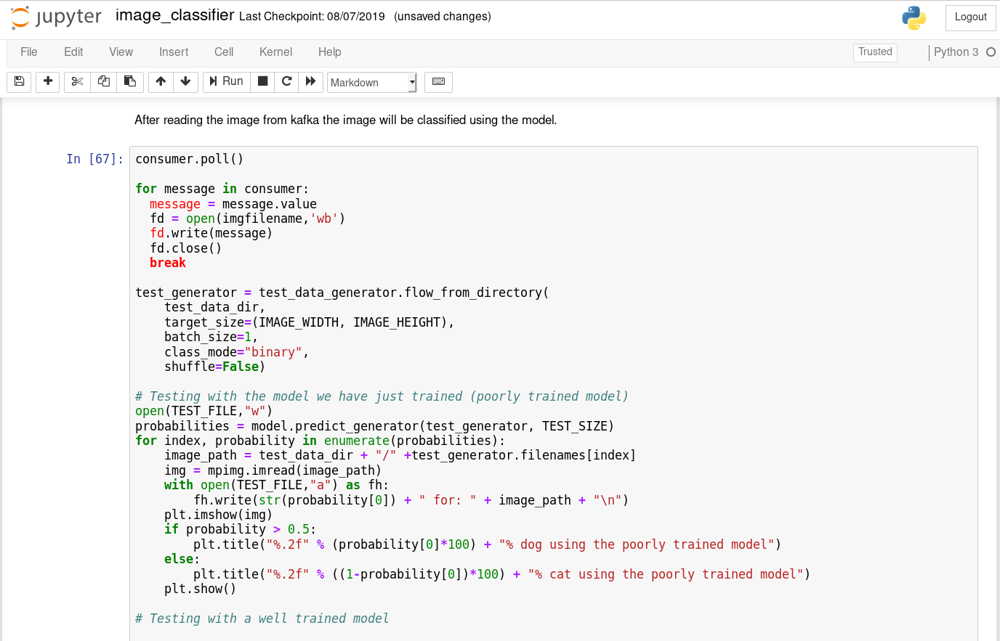

# Lab04: Machine Learning/Artificial Inteligence workloads

Machine learning and Artificial intelligence are one of technology topics we are used to hear about nowadays.

Although you can use several technologies to build these kind of workloads [Jupyter notebooks](https://jupyter.org/) are one of most common.

As an example you are going to deploy a Jupyter notebook that classifies images between two groups:

* Cats
* Dogs

This notebook is a modified version of the [image_classifier notebook](https://github.com/gsurma/image_classifier).

>  **__INFORMATION__**: This notebook implements a [Convolutional Neural Network Image classifier](https://en.wikipedia.org/wiki/Convolutional_neural_network).

When the application is running your tasks will be:

* You will have to train the model with a preloaded set of photos included in the notebook for the sake of simplicity.

>  **__WARNING__**: Training the model with an appropiate set of images (25000) took 35 hours in an **4-cores Intel(R) Core(TM) i7-4710HQ CPU @ 2.50GHz** CPU. Due this lab is limited to 2 hours the notebook includes a very reduced set of images and the resulting model will be not accurate enough.

You should get a similar graph after you train the model (80 training images, 20 validation images):


For a well trained model (20000 training images, 5000 validation images):


>  **__NOTE__**: You can see the differences between the **cost function** and the **accuracy** charts for both trainings.

* After training the model you will have to configure the notebook with the data of the [kafka broker you configured in Lab01: Deploy AMQ Streams](https://github.com/jadebustos/ocp-science/tree/master/hands-on-lab-script/amq-streams).

* You will send an image to kafka.

* The notebook will read the image from kafka and will guess if the image is a cat or a dog.

## High level pod description



## Lab's purpose

Illustrate how **OCP** + **AMQ Streams** can work together with **Machine learning/Artificial Intelligence** workloads to get the most of them.

## Notebook deployment

Create notebook on project ```rhte2019```:

```
$ oc run --image=quay.io/rhte_2019/ai-notebook:latest --port=8080 rhte-notebook
```

Create service and route

```
$ oc expose dc rhte-notebook
$ oc create route edge --service=rhte-notebook
```

The notebook should be available at the exposed route:

```
$ oc get route
NAME            HOST/PORT                                 PATH      SERVICES        PORT      TERMINATION   WILDCARD
rhte-notebook   rhte-notebook-rhte2019.apps.example.com             rhte-notebook   <all>     edge          None
```

Using a browser go to the previous route https://rhte-notebook-rhte2019.apps.example.com


You can get the token to access the jupyter notebook from the pod logs:

```
$ oc logs rhte-notebook-1-nst7j
[I 17:10:45.042 NotebookApp] Writing notebook server cookie secret to /opt/work/.local/share/jupyter/runtime/notebook_cookie_secret
[I 17:10:45.274 NotebookApp] JupyterLab extension loaded from /opt/conda/lib/python3.7/site-packages/jupyterlab
[I 17:10:45.274 NotebookApp] JupyterLab application directory is /opt/conda/share/jupyter/lab
[I 17:10:45.276 NotebookApp] Serving notebooks from local directory: /opt/work
[I 17:10:45.276 NotebookApp] The Jupyter Notebook is running at:
[I 17:10:45.276 NotebookApp] http://(rhte-notebook-1-nst7j or 127.0.0.1):8080/?token=1e23954e436211604ec37e0c869827e3ed6db8098f20481a
[I 17:10:45.276 NotebookApp] Use Control-C to stop this server and shut down all kernels (twice to skip confirmation).
[W 17:10:45.279 NotebookApp] No web browser found: could not locate runnable browser.
[C 17:10:45.280 NotebookApp]

    To access the notebook, open this file in a browser:
        file:///opt/work/.local/share/jupyter/runtime/nbserver-8-open.html
    Or copy and paste one of these URLs:
        http://(rhte-notebook-1-nst7j or 127.0.0.1):8080/?token=1e23954e436211604ec37e0c869827e3ed6db8098f20481a

```

## Using the application

When you connect to the application you will see:



The Jupyter Notebook has cells, some cells are only text and other are code that you can run. The code cells you can run starts with:

```
In [X]:
```

The result of the execution, if any, is stored in other cell:

```
Out [X]:
```

To run a cell you need to put the cursor on the cell and press **Ctrl + Shift**. To train the model you will need to go to the first code cell and run it.



>  **__NOTE__**: Train a model will take seven minutes (approx).

This will take a while because the model has to be trained. When it finised you will have to go to the following cell and you will have to modifiy some parameters in the cell:



The following parameters will have to be modified to fit your environment:

* **topic** you will have to set the topic to the one you created in the [Lab01: Deploy AMQ Streams](https://github.com/jadebustos/ocp-science/tree/master/hands-on-lab-script/amq-streams).
* **kafkaendpoint** you will have to set the endpoint to the one you created in the [Lab01: Deploy AMQ Streams](https://github.com/jadebustos/ocp-science/tree/master/hands-on-lab-script/amq-streams#lab01-deploy-amq-streams).
* **kafkaport** you will have to se the kafka port to the one you created in the [Lab01: Deploy AMQ Streams](https://github.com/jadebustos/ocp-science/tree/master/hands-on-lab-script/amq-streams#lab01-deploy-amq-streams).

After you have configured these parameters you will have to run the cell to create the kafka consumer.

Once the kafka consumer is started you can run the following cell:



this cell will read an image from kafka and will perform two predictions:

* First prediction: Using the model you have just trained (poorly trained model)
* Second prediction: Using a well-trained model.

>  **__TIP__**: Every time you run this cell the notebook will download an image from kafka to make the predictions.


## Improvements

If the set of images used to train the model are not enough to get a good model then more images will have to be added.

As the container image used for this lab has the images included in it we have the following options:

1. Copy more images to the running container.
2. Create a new container with more images and redeploy the pod.

The first option has the inconvenient that the container is not using persistent storage the new images will be lost after the container ends. The second option could be time consuming, create a new container image, upload to the registry and redeploy the pod.

We have two alternatives using **Red Hat** products to solve it:

1. Using a kafka topic to store the images. (**AMQ Streams**)
2. Store the images in Object Storage. (**Red Hat Ceph Storage**)

Do you dare?

>  **__TIP__**: Training images for animal type (cat or dog) have to be stored in **data/training/animal** and validation images in **data/validation/animal**.

## A bit of fun?

If you are curious about this kind of applications or you only want to have just a bit of fun you can play a bit. Here some suggestions.

### Verifying how the well trained model is more accurate than the model you have just trained

* https://img.europapress.es/fotoweb/fotonoticia_20170622121827-17062170019_800.jpg
* https://images-na.ssl-images-amazon.com/images/I/917iZaaFOgL._SX425_.jpg
* https://img.europapress.es/fotoweb/fotonoticia_20170622121827-17062170039_125.jpg
* https://static.boredpanda.com/blog/wp-content/uploads/2019/04/adorable-hairless-sphynx-kittens-fb5-png__700.jpg
* https://img.europapress.es/fotoweb/fotonoticia_20170622121827-17062170139_125.jpg
* https://getleashedmag.com/wp-content/uploads/2017/01/spynh-feature.jpg
* https://img.europapress.es/fotoweb/fotonoticia_20170622121827-17062170079_125.jpg
* https://i.ytimg.com/vi/zUWlAtat8ww/hqdefault.jpg
* http://www.arrecal.com/images/1clasificado-collera-de-podencos-los-brincas.JPG
* https://merchdope-zpq4xnxcq9v.netdna-ssl.com/wp-content/uploads/2018/10/Afghan-Hound-1.jpg

### The well trained model is not performing as well as your model

* https://www.elheraldo.co/sites/default/files/styles/width_860/public/articulo/2018/05/12/perro.jpg?itok=o-V5_DxL
* https://pictures-of-cats.org/wp-content/uploads/2018/03/Sphynx-cat-by-Helmi-Flick-X.jpg
* https://media.metrolatam.com/2019/01/29/memeperrodrogado-42777b43147e26a68fab3fd0729b24a3-600x400.jpg
* https://pics.me.me/hairless-cats-hairless-cats-twitter-49621967.png

### The well trained model is performing quite poorly

* https://upload.wikimedia.org/wikipedia/commons/thumb/f/fe/American_Eskimo_Dog_1.jpg/245px-American_Eskimo_Dog_1.jpg
* https://img.europapress.es/fotoweb/fotonoticia_20170622121827_260.jpg
* https://www.dogalize.com/wp-content/uploads/2017/05/551-pdengo-portugues-cerdoso-grande.jpg

### Both models are trolling me?

* https://d17fnq9dkz9hgj.cloudfront.net/uploads/2018/04/Minskin_01.jpg
* https://img.europapress.es/fotoweb/fotonoticia_20170622121827-17062170159_125.jpg
* http://www.lifewithcatman.com/wp-content/uploads/2018/03/37023296_208811373306721_2331537861515411456_n.jpg
* https://img.europapress.es/fotoweb/fotonoticia_20170622121827-17062170069_125.jpg
* https://cdn.fstoppers.com/styles/large-16-9/s3/lead/2018/12/cat-parody-instagram-removal.jpg
* https://img.europapress.es/fotoweb/fotonoticia_20170622121827-17062170109_125.jpg
* http://www.sosgalgos.com/wp-content/uploads/2018/04/Puskas01_620x400.jpg

### Use your imagination

* Have you known any cartoon based on a cat or a dog?
* You could try with your photo or a photo's friend/collegue ...

## Lab resources

You can find all the resources to build the container in [this directory](https://github.com/jadebustos/ocp-science/tree/master/hands-on-lab-script/applications/ai-notebook/).

## Next Lab
Go to [Lab05: Training workloads](https://github.com/jadebustos/ocp-science/blob/master/hands-on-lab-script/applications/training.md)
