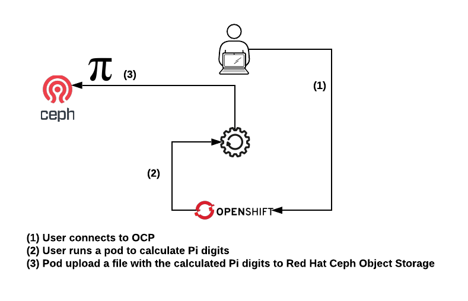

# Lab06: Computing workloads

We can use **OCP** to run non-interactive jobs. For instance pure computing jobs.

In this lab we are going to run a job that computes **Pi** with the accuracy you want (bare in mind that this lab is a 2-hour lab). After computing **Pi** a file will be stored in **Red Hat Ceph Storage** so you can get the result.

You can validate the results using [Pi constant generator](https://www.browserling.com/tools/pi-digits).

**Pi** will be calculated using the [Chudnovsky algorithm](https://en.wikipedia.org/wiki/Chudnovsky_algorithm). The implementation used in this lab is the [GMP](https://gmplib.org/) and [OMP](https://www.openmp.org/) version taken from (https://github.com/jadebustos/science/tree/master/pi).

>  **__NOTE__**: This code was originally writen to check how a Fujitsu Primergy server scaled when additional boards were added to the server. This code is not intended to be an efficient code to get pi digits but to stress the CPUs.

## High level pod description



## Lab's purpose

Massive computing workloads can be adapted to run in OCP.

In this lab a code that was originally created to check how a Fujitsu Primergy server scaled when additonal boards were added to the server (more cpu cores) has been adapted to run in OCP. When computing finishes a file with the pi number will be uploaded to a S3 bucket in Ceph Storage.

>  **__NOTE__**: No changes were made to the original code. The code runs as it was designed.

## Application deployment

>  **__WARNING__**: you must have the [Ceph lab](https://github.com/jadebustos/ocp-science/tree/master/hands-on-lab-script/ceph) completed and keep it working before start with this one.

Create a new project:

```
$ oc new-project pi
```

To deploy this app is as simple as execute the following command:

```
$ export S3_ENDPOINT=$(oc get route ceph-nano -n ceph -o jsonpath="{.spec.host}")

$ export S3_BUCKET=<name_of_the_bucket_created_for_lab06>
```

for example:

```
$ export S3_BUCKET=bucket-lab06
```

To deploy:

```
$ oc process -f ~/ocp-science/hands-on-lab-script/applications/pi/resources/openshift/template.yml \
  -p S3_ACCESS_KEY=foo \
  -p S3_SECRET_KEY=bar \
  -p S3_HOST=${S3_ENDPOINT} \
  -p S3_BUCKET=${S3_BUCKET}
  | oc create -f -
```

This will execute the pi calculator with the default values of:

- THREADS: Number of threads/processes to be used to calculate pi (Default: 1 thread)
- DIGITS: Number of Pi's digits (Default: 10 digits)

>  **__TIP__**: When the pod finished upload a file to the bucket with the number pi so you can access the bucket to retrieve it.

To check the content of the output:
```
$ oc logs pi
upload: '/root/bin/pi_txt_file.20190917153454' -> 's3://bucket-lab06/pi_txt_file.20190917153454' (21 bytes in 0.1 seconds, 415.41 B/s) [1 of 1]

$ s3cmd get s3://bucket-lab06/pi_txt_file.20190917153454

$  cat pi_txt_file.20190917153454
3.1415926535
```

You can also set different values for both THREADS and DECIMALS (DIGITS) as follows (or just one of both):

```
$ oc delete pod pi
$ oc process -f https://raw.githubusercontent.com/jadebustos/ocp-science/master/hands-on-lab-script/applications/pi/resources/openshift/template.yml \
    -p S3_ACCESS_KEY=foo \
    -p S3_SECRET_KEY=bar \
    -p S3_HOST=${S3_ENDPOINT} \
    -p S3_BUCKET=${S3_BUCKET} \
    -p DECIMALS=20 \
    -p THREADS=2 \
    | oc apply -f -
```

## Lab resources

You can find all the resources to build the container in [this directory](https://github.com/jadebustos/ocp-science/tree/master/hands-on-lab-script/applications/pi/resources).
