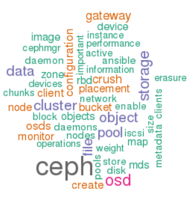
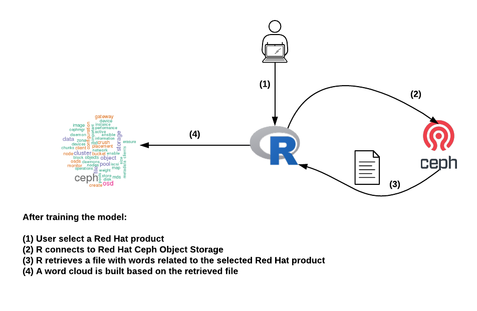

# Lab03: R Shiny workloads

This application will create words cloud for some Red Hat products.

The user will select one of the Red Hat products available:

* **Red Hat Virtualization**
* **Red Hat Openstack Platform**
* **Red Hat Ceph Storage**
* **Openshift Container Platform**
* **Red Hat Ansible Engine**

Depending on the selected product the application will get a file containing words related to the product and create the word cloud. The files used to create the word cloud will be stored in Red Hat Ceph Storage.

>  **IMPORTANT**: You need to have completed the [Lab02: Ceph-nano deployment](https://github.com/jadebustos/ocp-science/blob/master/hands-on-lab-script/ceph/README.md).



## High level pod description



## Lab's purpouse

Illustrate how **Red Hat Ceph Storage** can be used as a data backend for applications running in **OCP**.

## Application deployment

First of all we should create a new project:

```
$ oc new-project r-shiny
```

To deploy this app is as simple as execute the following commands:

```
$ export S3_ENDPOINT=$(oc get route ceph-nano -n ceph -o jsonpath="{.spec.host}")
$ export S3_BUCKET=<name_of_the_bucket_created_for_lab03>
```

for example:

```
$ export S3_BUCKET=bucket-lab03
```

To deploy:

```
$ oc process -f ~/ocp-science/hands-on-lab-script/applications/shiny-app/resources/openshift/template.yml \
    -p S3_ACCESS_KEY=foo \
    -p S3_SECRET_KEY=bar \
    -p S3_HOST=${S3_ENDPOINT} \
    -p S3_PORT=80 \
    -p S3_BUCKET=${S3_BUCKET} \
    | oc create -f -
```

>  **TIP**: You need configure the above variables with the values from [Lab02: Ceph-nano deployment](https://github.com/jadebustos/ocp-science/blob/master/hands-on-lab-script/ceph/README.md).

After some initialization, assuming that everything is fine we should see our Pod running. Next thing is to expose it (expose containers internally as services and externally via routes):

```
$ oc expose pod shiny-app
$ oc expose service shiny-app
```

## Application access

How you can access your app ? Check the created route:

```
$ oc get route shiny-app
NAME        HOST/PORT                                                         PATH   SERVICES    PORT   TERMINATION   WILDCARD
shiny-app   shiny-app-r-shiny.apps.cluster-4b5f.4b5f.sandbox255.opentlc.com          shiny-app   3838                 None

```

Copy the value of the column `HOST` and put it in your browser. For example:

```
http://shiny-app-r-shiny.apps.cluster-4b5f.4b5f.sandbox255.opentlc.com
```

Once opened, select a product from the drop-down menu (Red Hat Ceph Storage, Red Hat Ceph Storage, Red Hat Ceph Storage, Red Hat Virtualization, Red Hat Virtualization). For each product, **containing words related to the product, which are served by Ceph, are shown**.

"Play" with **Minimum word frequency** and **Maximum number of words**.

## Lab resources

You can find all the resources to build the container in [this directory](https://github.com/jadebustos/ocp-science/tree/master/hands-on-lab-script/applications/shiny-app/resources).

## Next Lab
Go to [Lab04: Machine Learning/Artificial Inteligence workloads](https://github.com/jadebustos/ocp-science/blob/master/hands-on-lab-script/applications/ml.md)
