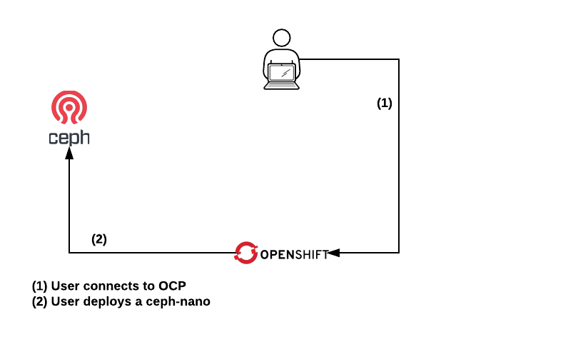

# Lab02: Ceph-nano deployment

## Ceph

Ceph provides storage:

* [Block](https://docs.ceph.com/docs/master/rbd/).
* [Object storage](https://docs.ceph.com/docs/master/radosgw/) a RESTful gateway which supports two interfaces: **Swift** and **S3**.
* [CephFS](https://docs.ceph.com/docs/master/cephfs/) a POSIX-compliant filesystem.

Ceph Storage can be easily used to store and retrieve data from any application that implements **Swift** or **S3**.

Installing a Ceph Storage Cluster takes a while and requires resources. For developers it could be complicated to deploy a full Ceph Storage cluster just to tests their applications.

## High level pod description



## Lab's purpose

[Ceph-nano](https://github.com/ceph/cn) can be used for developers to test their applications in an easy way.

As Ceph-nano can be deployed in containers in this lab you will deploy it inside OCP that illustrate how developers could use it to test their applications with no dependency from external departments.

> IMPORTANT: Ceph-nano is not intended for production purpouses but for testing.

## Install Ceph-Nano [WIP]

```
$ oc new-project ceph
$ oc adm policy add-scc-to-user anyuid -z default -n ceph
$ oc create -f ceph-nano.yaml -n ceph
$ export CEPH_ENDPOINT=$(oc get route ceph-nano -n ceph | awk 'NR>1{print $2;exit;}')
$ oc set env sts ceph-nano RGW_NAME=$CEPH_ENDPOINT
$
```

Wait until the pod ```ceph-nano-0``` is running, then:

```
$ oc exec -i ceph-nano-0 bash <<EOF
sed -i "s/127.0.0.1:8000/$CEPH_ENDPOINT/g" /opt/ceph-container/sree/static/js/base.js
EOF
$
```

## Create buckets and upload data

One Ceph-nano has been successfully deployed you will have to perform some tasks. You will create two buckets that will be used in another labs.

For the [Lab03: R Shiny workloads](https://github.com/jadebustos/ocp-science/blob/master/hands-on-lab-script/applications/r-shiny.md) you will have to:
 
1. Create a bucket.
2. Upload these files to the bucket: [ansible.txt.gz](data/ansible.txt.gz), [ceph.txt.gz](data/ceph.txt.gz), [ocp.txt.gz](data/ocp.txt.gz), [osp.txt.gz](data/osp.txt.gz), [rhv.txt.gz](data/rhv.txt.gz)

> IMPORTANT: Take note of your S3 bucket and credentials to use them in the [Lab03: R Shiny workloads](https://github.com/jadebustos/ocp-science/blob/master/hands-on-lab-script/applications/r-shiny.md).

For the [Lab06: Computing workloads](https://github.com/jadebustos/ocp-science/blob/master/hands-on-lab-script/applications/pi.md) you will have to:

1. Create a bucket.

> IMPORTANT: Take note of your S3 bucket and credentials to use them in the [Lab06: Computing workloads](https://github.com/jadebustos/ocp-science/blob/master/hands-on-lab-script/applications/pi.md).

## Scritps to perform operations on S3

If you want to use these scripts you will have to create the __endpoint.json__ file with the data to access your S3 endpoint:

```
{
    "access_key": "vendoopelcorsa",
    "secret_key": "enbuenestado",
    "endpoint_url": "radosgw.example.com",
    "endpoint_port": "80"
}
```

### __list_buckets.py__ script

You can use the [list_buckets.py](scripts/list_buckets.py) script to list the buckets in the S3 endpoint:

```
$ python list_buckets.py
```

### __s3createbucket.py__ script

You can use the [s3createbucket.py](scripts/s3createbucket.py) script to create buckets:

```
$ python s3createbucket.py --bucket BUCKETNAME
```

### __s3deletebucket.py__ script

You can use the [s3deletebucket.py](scripts/s3deletebucket.py) script to delete a bucket:

```
$ python s3deletebucket.py --bucket BUCKETNAME
```
### __s3uploadfiles.py__ script

You can use the [s3uploadfiles.py](scripts/s3uploadfiles.py) script to upload files to a bucket:

```
$ python s3uploadfiles.py --bucket BUCKETNAME --files "FILENAME1,FILENAME2,FILENAME3"
```

> TIP: You can update several files at a time using a "," as a separator.

### __s3deletefiles.py__ script

You can use the [s3deletefiles.py](scripts/s3deletefiles.py) script to delete files from a bucket:

```
$ python s3deletefiles.py --bucket BUCKETNAME --files "FILENAME1,FILENAME2,FILENAME3"
```

> TIP: You can delete several files at a time using a "," as a separator.

### __s3downloadfiles.py__ script

You can use the [s3downloadfiles.py](scripts/s3downloadfiles.py) script to download a file from a bucket:

```
$ python s3downloadfiles.py --bucket BUCKETNAME --files "FILENAME1,FILENAME2,FILENAME3"
```

> TIP: You can download several files at a time using a "," as a separator.

### __s3listbucket.py__ script

You can use the [s3listbucket.py](scripts/s3listbucket.py) scripts to list a bucket's content:

```
$ python s3listbucket.py --bucket BUCKETNAME
```

## How to Install s3cmd in Linux and Manage s3 Buckets

`s3cmd` is a command line utility used for creating s3 buckets, uploading, retrieving and managing data to s3 storage.

### Install s3cmd on Linux

You can install it simply executing following command on your system.

```
yum install -y https://dl.fedoraproject.org/pub/epel/7/x86_64/Packages/s/s3cmd-2.0.2-1.el7.noarch.rpm
```

### Configure s3cmd Environment

In order to configure `s3cmd` we can use below command to configure s3cmd in a interactive way:

```
s3cmd --configure
```

But we are going to create the config file manually:

1. Edit/create file in the user home path:

    ```
    vi ~/.s3cfg
    ```

2. Add the following:
    ```
    [default]
    access_key = foo
    host_base = ceph-nano-ceph.<your-cluster-apps-domain>
    host_bucket = ceph-nano-ceph.<your-cluster-apps-domain>
    secret_key = bar
    ```

### Uses of s3cmd Command Line

1. List All S3 Bucket: Use the following command to list all s3 buckets in your aws account.

    ```
    s3cmd ls
    ```

2. Creating New Bucket: To create a new bucket in Amazon s3 use below command. It will create bucket named tecadmin in S3 account.
    ```
    s3cmd mb s3://my-bucket
    ```

3. Uploading file in Bucket: Below command will upload file file.txt to s3 bucket using s3cmd command.

    ```
    s3cmd put my-file.txt s3://my-bucket/
    ```

4. List Data of S3 Bucket: List the objects of s3 bucket using ls switch with s3cmd.

    ```
    s3cmd ls s3://my-bucket/
    ```

5. Download Files from Bucket: Sometimes if we need to download files from the s3 bucket, Use following commands to download it.

    ```
    s3cmd get s3://my-bucket/my-file.txt
    ```

6. Remove Data of S3 Bucket: To remove files are folder from s3 bucket use following commands.

    ```
    s3cmd del s3://my-bucket/my-file.txt
    ```

7. Remove S3 Bucket: If we don’t need s3 bucket anymore, we can simply delete it using the following command.

    ```
    s3cmd rb s3://my-bucket    
    ```

    >  **_WARNING_**: Before removing bucket make sure its empty.
